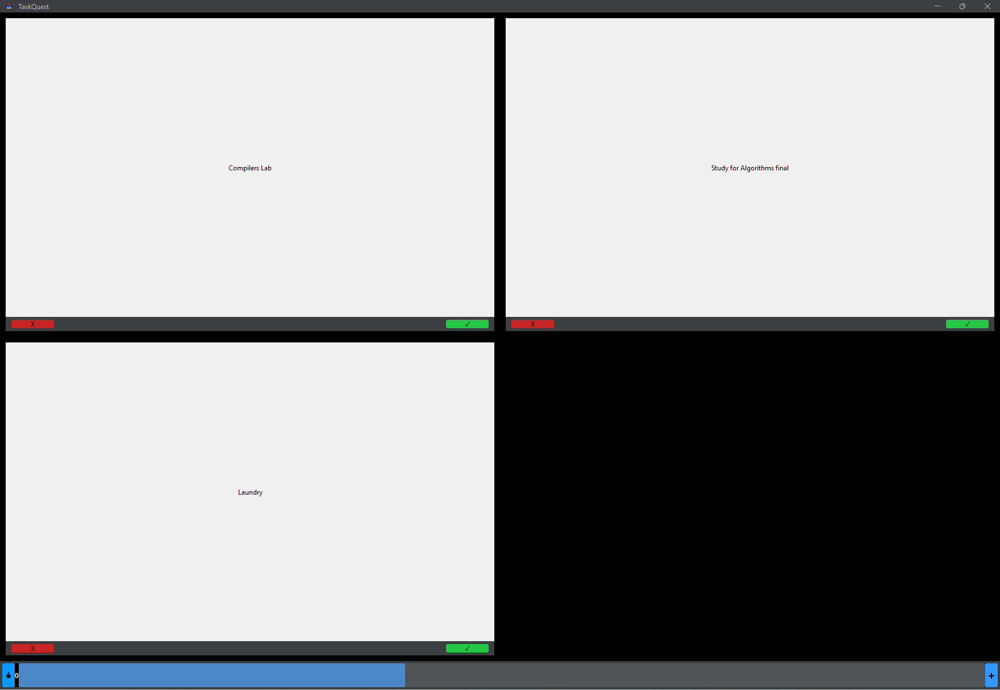
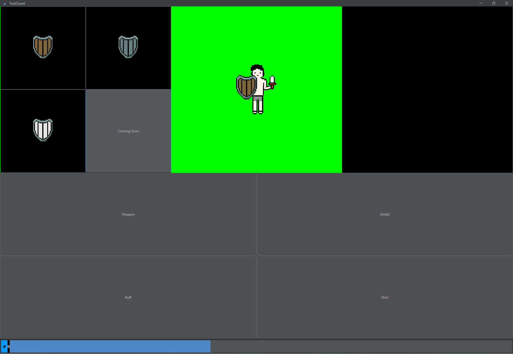

# Task Quest



A retro inspired task tracking app that allows users to gain XP for each task that they complete which can be used to customize their in app character.



### Initial Setup 

1. Make sure you have the Java SDK isntalled on your machine
2. Run ```git clone git@github.com:nmsu-cs/project-macintosh-mavericks-1.git``` from terminal.
3. link the ```flatlaf-3.4.1.jar``` file in VScode by navigating to the java projects tab at the bottom left and hovering over the ```referenced libraries``` section, then click the '+' symbol and selecting ```flatlaf-3.4.1.jar```.


### How to run?

1. Within the build, run TaskQuest.java with VSCode with the run program.
2. Each file runs within each other and all compiles within the main function in ```TaskQuest.java```.
3. JPanel was executed with TaskQuest to get the program to run.
4. Make sure files are in same directory.
5. git status to show the working directory you are currently working in.

Within TaskQuest code there are two areas that if you computer does not run the program to comment out the section of the code. Both sections are withing the main function of ```TaskQuest.java```.
First, is the FlatDarkLaf.setup().
Second it the try{} section at the very bottom. 


 
#### Enter this command to compile the program
```javac TaskQuest.java```

java TaskQuest

Make sure all files in same directory.


#### Enter this command to run the program

```java TaskQuest```

In terminal, or run button in VSCode or your favorite IDE. 

